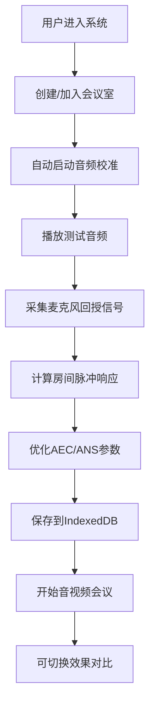

## 1. 产品概述

WebRTC音视频会议系统，提供高质量的实时音视频通信，核心创新在于动态噪声抑制和回声消除的自适应校准技术。通过播放标准测试音频并分析回授信号，系统自动优化音频处理参数，为用户提供最佳的会议体验。

- 主要目的：解决音视频会议中的回声和噪声问题，提供自适应的音频校准
- 目标用户：远程办公团队、在线教育机构、虚拟会议组织者
- 产品价值：显著提升会议音频质量，减少人工调试时间

## 2. 核心功能

### 2.1 用户角色
| 角色 | 注册方式 | 核心权限 |
|------|---------|---------|
| 会议参与者 | 匿名/用户名 | 创建会议室、加入会议、控制音视频设备 |

### 2.2 功能模块
1. **会议室管理页**：创建房间、加入房间、房间列表
2. **音视频会议室**：实时音视频传输、设备选择、参与者列表
3. **音频校准模块**：自动测试音频播放、信号采集、参数计算
4. **效果对比面板**：校准前后效果对比开关、参数可视化

### 2.3 页面详情
| 页面名称 | 模块名称 | 功能描述 |
|---------|---------|---------|
| 会议室管理页 | 房间创建模块 | 输入房间名称、自动生成房间ID、复制分享链接 |
| 会议室管理页 | 房间加入模块 | 输入房间ID、验证房间存在性 |
| 音视频会议室 | 视频显示区 | 本地预览、远程参与者视频网格布局 |
| 音视频会议室 | 控制面板 | 麦克风开关、摄像头开关、屏幕共享、离开会议 |
| 音视频会议室 | 音频校准面板 | 开始校准按钮、校准进度条、校准结果展示 |
| 音视频会议室 | 效果对比开关 | 切换校准前后参数、实时对比音频效果 |

## 3. 核心流程

用户进入系统 → 创建或加入会议室 → 系统自动启动音频校准 → 播放测试音频（1kHz正弦波、粉红噪声、语音片段各3秒）→ 采集麦克风回授信号 → 计算房间脉冲响应 → 优化AEC/ANS参数 → 保存参数到IndexedDB → 开始实时音视频会议 → 可随时切换校准前后效果对比

## 4. 用户界面设计

### 4.1 设计风格
- 主色调：深蓝色 #165DFF（专业、科技感）
- 辅助色：青色 #00B42A（成功）、橙色 #FF7D00（警告）
- 按钮风格：圆角8px、微悬浮效果、柔和阴影
- 字体：Inter + JetBrains Mono（现代、清晰）
- 布局风格：深色主题、卡片式布局、毛玻璃效果
- 图标风格：线性图标、简洁现代

### 4.2 页面设计概览
| 页面名称 | 模块名称 | UI元素 |
|---------|---------|-------|
| 会议室管理页 | 主容器 | 居中卡片、渐变背景、微妙动效 |
| 音视频会议室 | 视频区 | 网格布局、圆角边框、悬停高亮 |
| 音视频会议室 | 控制面板 | 底部固定、半透明背景、图标按钮 |
| 音视频会议室 | 校准面板 | 侧边抽屉、进度动画、波形可视化 |

### 4.3 响应式
- 桌面端优先，适配1920×1080及以上
- 平板端自适应网格布局
- 移动端简化控制面板，优化触摸区域
