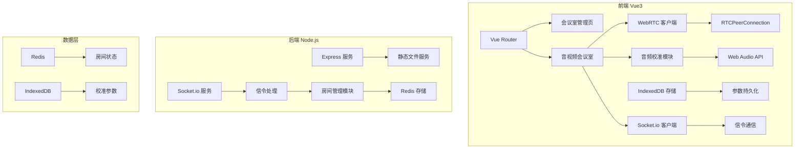
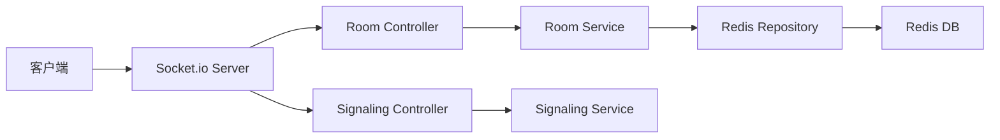

## 1. 架构设计



## 2. 技术描述

- **前端**: Vue@3.4 + Vite@5 + TypeScript@5 + Vue Router@4 + Pinia@2
- **UI 框架**: Element Plus@2 + Tailwind CSS@3
- **WebRTC**: 原生 RTCPeerConnection + Web Audio API
- **信令**: Socket.io@4 (客户端)
- **存储**: IndexedDB (本地校准参数)

- **后端**: Node.js + Express@4 + Socket.io@4
- **数据存储**: Redis (房间状态管理)

## 3. 路由定义
| 路由 | 页面组件 | 用途 |
|------|---------|------|
| / | HomePage | 首页，创建/加入会议室 |
| /room/:roomId | RoomPage | 音视频会议室页面 |

## 4. API 定义 (Socket.io 事件)

### 4.1 房间管理事件
```typescript
// 客户端发送
interface CreateRoomRequest {
  roomName: string;
  userName: string;
}

interface JoinRoomRequest {
  roomId: string;
  userName: string;
}

// 服务端响应
interface RoomCreatedResponse {
  roomId: string;
  roomName: string;
  participants: Participant[];
}

interface RoomJoinedResponse {
  roomId: string;
  roomName: string;
  participants: Participant[];
}

interface Participant {
  id: string;
  name: string;
  isAudioEnabled: boolean;
  isVideoEnabled: boolean;
}
```

### 4.2 WebRTC 信令事件
```typescript
interface OfferSignal {
  targetId: string;
  sdp: RTCSessionDescriptionInit;
}

interface AnswerSignal {
  targetId: string;
  sdp: RTCSessionDescriptionInit;
}

interface IceCandidateSignal {
  targetId: string;
  candidate: RTCIceCandidateInit;
}
```

## 5. 服务器架构图



## 6. 数据模型

### 6.1 IndexedDB 数据模型
```typescript
// 校准参数存储
interface CalibrationParams {
  id?: number;
  roomId: string;
  userId: string;
  timestamp: number;
  aecLevel: number;      // 回声消除强度 0-100
  aecDelay: number;      // 回声延迟 ms
  ansLevel: number;      // 噪声抑制强度 0-100
  noiseFloor: number;    // 本底噪声水平 dB
  echoReturnLoss: number;// 回声返回损耗 dB
  roomImpulseResponse: number[]; // 房间脉冲响应
}
```

### 6.2 Redis 房间状态
```typescript
interface RoomState {
  roomId: string;
  roomName: string;
  createdAt: number;
  participants: {
    [userId: string]: {
      name: string;
      isAudioEnabled: boolean;
      isVideoEnabled: boolean;
      joinedAt: number;
    }
  };
}
```

## 7. 音频校准算法流程

1. **测试音频生成**
   - 1kHz 正弦波: Web Audio API OscillatorNode
   - 粉红噪声: ScriptProcessor 生成
   - 语音片段: 预录制或 TTS 生成

2. **信号采集**
   - getUserMedia 获取麦克风流
   - AnalyserNode 实时分析音频数据
   - 录制 9 秒回授信号

3. **脉冲响应计算**
   - 互相关算法计算 RIR
   - 自适应滤波器识别回声路径

4. **参数优化**
   - 根据噪声水平调整 ANS 增益
   - 根据回声延迟设置 AEC 滤波器长度
   - 计算最佳回声抑制阈值
