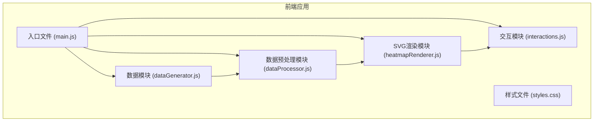

## 1. 架构设计



## 2. 技术选型

- 前端技术栈：原生 HTML5 + CSS3 + JavaScript ES6+
- 可视化库：D3.js v7 (用于SVG操作和比例尺计算)
- 构建工具：无构建依赖，纯静态文件，直接浏览器运行
- 数据：前端模拟生成JSON数据，无需后端服务

## 3. 模块化设计

| 模块文件 | 功能描述 |
|---------|---------|
| index.html | 页面结构，容器布局 |
| styles.css | 全局样式、热图样式、tooltip样式 |
| dataGenerator.js | 模拟生成100个样本的SNP数据 |
| dataProcessor.js | 数据预处理，计算变异频率统计 |
| heatmapRenderer.js | SVG热图渲染核心模块 |
| interactions.js | 鼠标交互、tooltip显示、缩放控制 |

## 4. 数据模型

### 4.1 SNP数据结构

```javascript
// 单个SNP位点
interface SNPLocus {
  position: number;        // 基因坐标位置
  refBase: string;         // 参考碱基 (A/T/C/G)
}

// 单个样本
interface Sample {
  id: string;              // 样本ID
  snps: Array<{
    position: number;      // 基因坐标
    refBase: string;       // 参考碱基
    altBase: string;       // 变异碱基
    mutationType: string;  // 突变类型 (如 "A->T")
    quality: number;       // 质量值
  }>;
}

// 变异频率统计
interface MutationStats {
  totalSamples: number;
  totalPositions: number;
  mutationCounts: Record<string, number>;  // 各突变类型计数
  positionFrequencies: Array<{
    position: number;
    frequency: number;
  }>;
}
```

### 4.2 数据生成规则
- 样本数量：100个，样本ID格式为 "Sample_001" 到 "Sample_100"
- 基因位点数量：50个坐标点
- 参考碱基：随机选择 A/T/C/G
- 变异类型：12种可能的碱基突变组合
- 质量值：0-100的随机数值

## 5. 核心功能实现要点

### 5.1 D3.js热图绘制
- 使用 `d3.scaleBand()` 创建X/Y轴比例尺
- 使用 `d3.scaleOrdinal()` 或 `d3.scaleSequential()` 映射颜色
- 使用 `d3.select()` 操作SVG元素
- 使用 `d3.axisBottom()` 和 `d3.axisLeft()` 绘制坐标轴

### 5.2 交互实现
- `mouseover/mouseout` 事件触发tooltip显示/隐藏
- `d3.pointer()` 获取鼠标位置计算tooltip坐标
- CSS过渡动画实现平滑效果

### 5.3 性能优化
- 数据处理使用纯函数，避免副作用
- SVG元素复用，减少DOM操作
- Tooltip使用单一DOM元素复用
