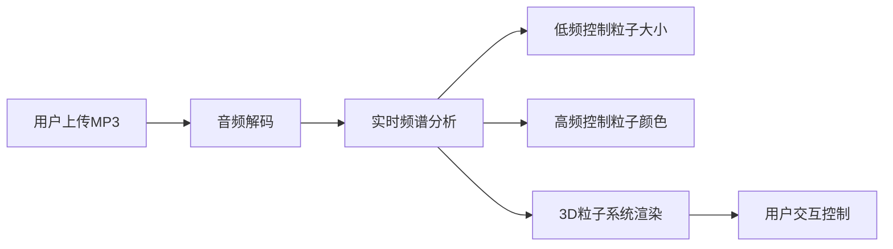

## 1. 产品概述
3D音频可视化粒子系统是一个交互式网页应用，通过WebGL技术将用户上传的MP3音频文件转换为动态的3D粒子视觉效果。低频部分控制粒子大小，高频部分控制粒子颜色，为用户提供沉浸式的音乐可视化体验。

## 2. 核心功能
### 2.1 功能模块
1. **主页面：3D粒子可视化区域、音频上传控制区、播放控制区

### 2.2 页面详情
| 页面名称 | 模块名称 | 功能描述 |
|-----------|-------------|---------------------|
| 主页面 | 3D粒子系统 | 实时渲染数千个粒子的3D可视化效果 |
| 主页面 | 音频上传 | 支持MP3文件上传与播放 |
| 主页面 | 频谱分析 | 实时分析音频频谱数据 |
| 主页面 | 播放控制 | 播放/暂停、音量调节、进度控制 |

## 3. 核心流程
用户上传MP3文件 → 系统解码音频 → 实时分析频谱 → 驱动3D粒子运动和颜色变化 → 用户可交互控制

## 4. 用户界面设计
### 4.1 设计风格
- 主色调：深黑色背景，配合霓虹色粒子效果
- 深色科技感、沉浸式视觉风格
- 简洁的控制面板，半透明玻璃态效果
- 字体：现代无衬线字体
- 整体氛围：赛博朋克/未来科技风

### 4.2 页面设计概述
| 页面名称 | 模块名称 | UI元素 |
|-----------|-------------|-------------|
| 主页面 | 3D场景 | 全屏Canvas渲染，黑色背景，粒子发光效果 |
| 主页面 | 控制面板 | 底部悬浮半透明面板，圆角设计，模糊背景 |
| 主页面 | 上传区域 | 拖拽上传按钮，悬停动效 |

### 4.3 响应式
- 桌面端优先
- 移动端自适应布局
- 触摸设备优化

### 4.4 3D场景设计
- 环境：纯黑背景，无光照依赖粒子自发光
- 相机：透视相机，可通过鼠标拖拽旋转视角
- 粒子：球形分布，动态响应音频
- 交互：鼠标悬停、拖拽旋转、滚轮缩放
- 粒子颜色：高频部分映射到HSB色轮
- 粒子大小：低频振幅映射到粒子缩放
