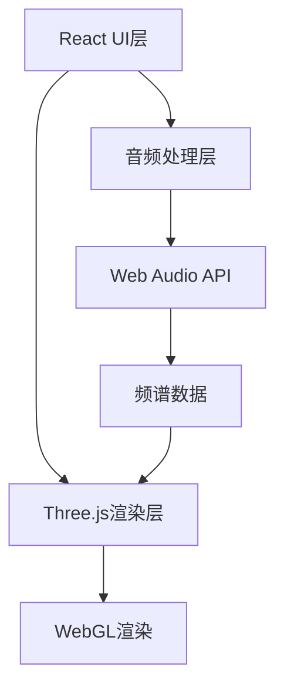

## 1. 架构设计


## 2. 技术描述
- 前端：React@18 + TypeScript + Vite
- 3D渲染：Three.js
- 样式：Tailwind CSS@3
- 音频分析：Web Audio API (AnalyserNode)
- 状态管理：React useState/useRef
- 图标：Lucide React

## 3. 项目结构
```
src/
├── components/
│   ├── ParticleSystem.tsx    # 3D粒子系统组件
│   ├── AudioUploader.tsx     # 音频上传组件
│   ├── AudioControls.tsx     # 播放控制组件
│   └── VisualizerCanvas.tsx  # 可视化画布容器
├── hooks/
│   ├── useAudioAnalyzer.ts   # 音频分析Hook
│   └── useParticleSystem.ts  # 粒子系统Hook
├── utils/
│   └── audioUtils.ts         # 音频工具函数
├── App.tsx
├── main.tsx
└── index.css
```

## 4. 核心技术实现
### 4.1 音频分析模块
- 使用 Web Audio API 的 AnalyserNode 获取频率数据
- FFT 大小设置为 2048，获取 1024 个频率点
- 低频段（0-100Hz）控制粒子大小
- 高频段（2kHz-10kHz）控制粒子颜色
- 数据平滑处理，避免视觉抖动

### 4.2 粒子系统
- 使用 Three.js 的 BufferGeometry 管理粒子数据
- 粒子数量：5000-10000 个
- 粒子初始位置：球形随机分布
- 自定义 ShaderMaterial 实现 GPU 加速的粒子动画
- 顶点着色器处理粒子位置和大小
- 片元着色器处理粒子颜色和发光效果

### 4.3 交互控制
- 鼠标拖拽：OrbitControls 控制相机旋转
- 滚轮：控制相机缩放
- 双击：重置视角
