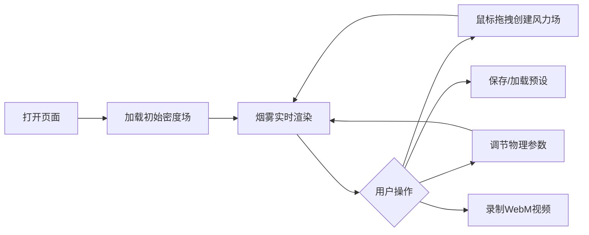

## 1. 产品概述
基于纳维-斯托克斯方程的GPU流体烟雾模拟系统，通过WebGL着色器实现实时计算。用户可通过鼠标创建风力场，调节物理参数，观察烟雾动态流动效果。
- 核心目的：提供交互式流体物理模拟演示，用于教育、艺术创作和视觉效果设计
- 目标用户：计算机图形学爱好者、设计师、教育工作者

## 2. 核心功能

### 2.1 Feature Module
1. **模拟主界面**：Three.js 3D画布、实时烟雾渲染、鼠标交互
2. **参数控制面板**：物理参数调节、可视化选项、录制控制
3. **后端服务**：配置文件管理、用户预设保存

### 2.3 Page Details
| Page Name | Module Name | Feature description |
|-----------|-------------|---------------------|
| 模拟主页面 | 3D画布 | 烟雾粒子实时渲染，热力图可视化（红-黄-白渐变） |
| 模拟主页面 | 鼠标交互 | 拖拽创建风力场，显示风向和强度指示器 |
| 模拟主页面 | 参数面板 | 粘性系数、扩散系数、时间步长、压力投影迭代次数滑块 |
| 模拟主页面 | 状态栏 | 帧率监控、录制状态指示 |
| 模拟主页面 | 录制功能 | WebM格式录制模拟过程 |

## 3. 核心 Process
用户打开页面 → 加载初始烟雾密度场 → 鼠标拖拽创建风力场 → 实时观察烟雾流动 → 调节物理参数 → 保存/加载预设 → 录制模拟过程

## 4. User Interface Design

### 4.1 Design Style
- **主色调**：深蓝科技风（#0a1628背景），青色高光（#00f5ff），热力图红-黄-白渐变
- **按钮风格**：圆角玻璃态，霓虹边框发光效果
- **字体**：JetBrains Mono 等宽字体用于数值显示，Inter 用于界面文本
- **布局风格**：左侧悬浮控制面板，主画布全屏展示
- **图标风格**：Lucide 线性图标，科技感线条设计

### 4.2 Page Design Overview
| Page Name | Module Name | UI Elements |
|-----------|-------------|-------------|
| 主模拟页 | 3D画布 | 全屏Three.js渲染，粒子效果，鼠标轨迹可视化 |
| 主模拟页 | 参数面板 | 玻璃态悬浮卡片，滑块控件，数值输入框 |
| 主模拟页 | 状态栏 | 左下角FPS计数器，右上角录制按钮 |
| 主模拟页 | 预设管理 | 下拉选择器，保存/删除按钮 |

### 4.3 Responsiveness
- 桌面端：左侧固定面板(320px)，主区域自适应
- 平板端：面板可折叠收起
- 移动端：基础功能支持，触控优化

### 4.4 3D Scene Guidance
- **环境**：深色背景，轻微噪点纹理
- **光照**：自发光粒子，无需额外光源
- **相机**：正交投影，2D顶视图
- **交互**：鼠标位置映射到风力场，拖拽方向决定风向
- **后处理**：轻微 Bloom 效果增强烟雾发光感
