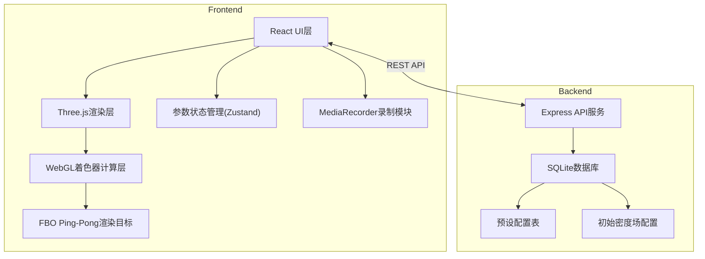
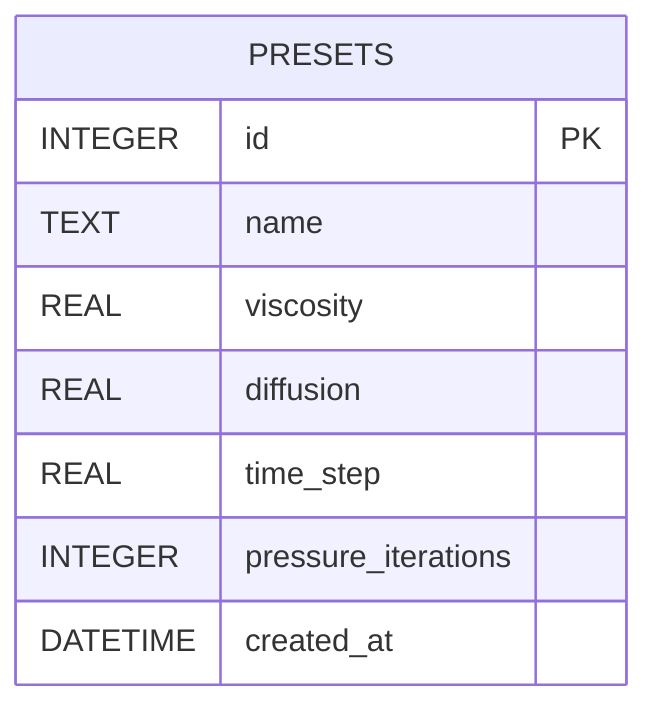

## 1. Architecture Design



## 2. Technology Description
- **Frontend**: React@18 + TypeScript + Vite + TailwindCSS@3 + Zustand
- **3D引擎**: Three.js + 自定义WebGL着色器
- **物理计算**: GPU加速纳维-斯托克斯方程求解
- **Backend**: Express@4 + TypeScript
- **Database**: SQLite (better-sqlite3)
- **录制**: MediaRecorder API (WebM格式)

## 3. Route Definitions
| Route | Purpose |
|-------|---------|
| / | 主模拟页面 |
| /api/presets | 获取/保存用户预设 |
| /api/presets/:id | 删除/更新预设 |
| /api/config/initial-density | 获取初始密度场配置 |

## 4. API Definitions

```typescript
// 预设数据结构
interface Preset {
  id: number;
  name: string;
  viscosity: number;
  diffusion: number;
  timeStep: number;
  pressureIterations: number;
  createdAt: string;
}

// GET /api/presets
type GetPresetsResponse = Preset[];

// POST /api/presets
interface CreatePresetRequest {
  name: string;
  viscosity: number;
  diffusion: number;
  timeStep: number;
  pressureIterations: number;
}
type CreatePresetResponse = Preset;

// DELETE /api/presets/:id
type DeletePresetResponse = { success: boolean };

// GET /api/config/initial-density
interface InitialDensityConfig {
  resolution: number;
  densityData: number[][];
}
```

## 5. Server Architecture Diagram


## 6. Data Model

### 6.1 Data Model Definition



### 6.2 Data Definition Language

```sql
CREATE TABLE IF NOT EXISTS presets (
  id INTEGER PRIMARY KEY AUTOINCREMENT,
  name TEXT NOT NULL,
  viscosity REAL NOT NULL,
  diffusion REAL NOT NULL,
  time_step REAL NOT NULL,
  pressure_iterations INTEGER NOT NULL,
  created_at DATETIME DEFAULT CURRENT_TIMESTAMP
);

-- 插入默认预设
INSERT INTO presets (name, viscosity, diffusion, time_step, pressure_iterations) VALUES
('标准配置', 0.0001, 0.0001, 0.05, 20),
('高粘性', 0.001, 0.0001, 0.05, 20),
('快速扩散', 0.0001, 0.001, 0.05, 20);
```
