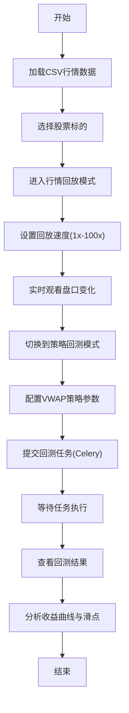

## 1. 产品概述
Level-2行情回放与策略回测平台，为量化交易者提供历史行情数据的高速回放和算法交易策略的回测验证功能。
- 解决量化策略研发中缺少真实行情回放环境和回测结果不准确的问题
- 目标用户：量化交易员、算法交易开发者、机构投资者

## 2. 核心功能

### 2.1 用户角色
| 角色 | 注册方式 | 核心权限 |
|------|---------|---------|
| 量化交易员 | 系统登录 | 行情回放、策略回测、结果查看 |

### 2.2 功能模块
1. **行情回放页面**：行情控制面板、Tick数据可视化、买卖盘口展示、逐笔成交列表
2. **策略回测页面**：策略参数配置、回测任务管理、回测结果分析
3. **回测结果页面**：收益曲线图表、滑点分析、成交明细、绩效指标

### 2.3 页面详情
| 页面名称 | 模块名称 | 功能描述 |
|---------|---------|---------|
| 行情回放 | 控制面板 | 加载CSV数据、播放/暂停/速度调节(1x-100x)、时间轴控制 |
| 行情回放 | 盘口可视化 | ECharts买卖盘口深度图、十档买卖盘实时更新 |
| 行情回放 | 逐笔成交 | 实时成交列表、大单高亮标记、成交量热力图 |
| 策略回测 | 策略配置 | VWAP参数设置、交易标的选择、下单金额配置 |
| 策略回测 | 任务管理 | 回测任务列表、任务状态监控、任务取消/重试 |
| 回测结果 | 绩效分析 | 收益曲线、回撤分析、胜率、夏普比率 |
| 回测结果 | 成交明细 | 每笔成交记录、滑点统计、交易成本分析 |

## 3. 核心流程

## 4. 用户界面设计

### 4.1 设计风格
- **主色调**：深蓝 #165DFF（专业金融风格）
- **辅助色**：绿色 #00B42A（上涨）、红色 #F53F3F（下跌）
- **按钮风格**：圆角矩形，悬停微动画，禁用状态灰色
- **字体**：JetBrains Mono（数据展示）、Noto Sans SC（中文文本）
- **布局风格**：多面板布局，可拖拽调整，数据密集型设计
- **图标风格**：Ant Design图标，简洁线性风格

### 4.2 页面设计概述
| 页面名称 | 模块名称 | UI元素 |
|---------|---------|--------|
| 行情回放 | 顶部控制栏 | 播放/暂停按钮、速度滑块、时间显示、股票选择下拉框 |
| 行情回放 | 左侧盘口面板 | 十档买卖盘表格，买绿卖红，价格、数量、金额列 |
| 行情回放 | 中间图表区 | ECharts深度图、分时走势图、成交量柱状图 |
| 行情回放 | 右侧成交列表 | 逐笔成交表格，实时滚动更新，大单高亮 |
| 策略回测 | 参数表单 | 标签页布局，策略选择、参数输入、滑块组件 |
| 回测结果 | 分析仪表盘 | 卡片式绩效指标，网格布局，图表并排展示 |

### 4.3 响应式
- Desktop-first设计，针对宽屏优化（最小支持1366px）
- 面板支持拖拽调整大小和位置
- 数据表格支持横向滚动

### 4.4 交互体验
- 行情回放时数据平滑过渡动画
- 买卖盘口价格变化高亮闪烁
- 回测任务进度条实时更新
- 图表支持缩放、tooltip、数据区域选择
