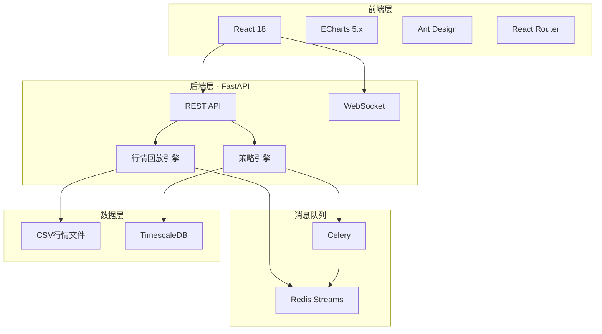
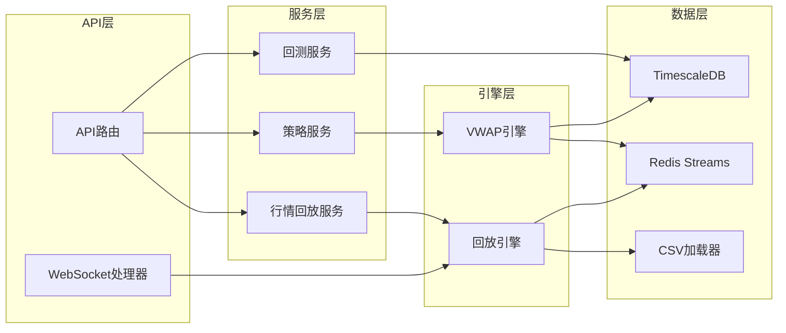

## 1. 整体架构设计



## 2. 技术栈说明

### 2.1 前端技术
- **框架**: React 18 + TypeScript
- **构建工具**: Vite
- **UI组件库**: Ant Design 5.x
- **图表库**: ECharts 5.x
- **路由**: React Router v6
- **状态管理**: Zustand
- **WebSocket**: 原生 WebSocket API

### 2.2 后端技术
- **Web框架**: FastAPI (Python 3.11+)
- **消息队列**: Redis 7.x + Redis Streams
- **任务队列**: Celery 5.x
- **时序数据库**: TimescaleDB (PostgreSQL 15+)
- **数据处理**: Pandas, NumPy

### 2.3 核心依赖
```yaml
frontend:
  react: ^18.2.0
  react-dom: ^18.2.0
  echarts: ^5.4.3
  echarts-for-react: ^3.0.2
  antd: ^5.12.0
  zustand: ^4.4.7
  react-router-dom: ^6.20.0

backend:
  fastapi: ^0.104.1
  uvicorn: ^0.24.0
  redis: ^5.0.1
  celery: ^5.3.4
  pandas: ^2.1.3
  numpy: ^1.26.2
  sqlalchemy: ^2.0.23
  psycopg2-binary: ^2.9.9
  python-multipart: ^0.0.6
  websockets: ^12.0
```

## 3. 路由定义

| 路由 | 页面/接口 | 用途 |
|------|----------|------|
| / | 行情回放页面 | 主页面，Tick数据回放与可视化 |
| /backtest | 策略回测页面 | 策略配置与任务管理 |
| /backtest/:id | 回测结果页面 | 回测绩效分析展示 |
| /api/replay/upload | POST | 上传CSV行情数据 |
| /api/replay/ticks | GET | 获取Tick数据 |
| /api/replay/ws | WebSocket | 实时行情推送 |
| /api/strategy/vwap | POST | 提交VWAP回测任务 |
| /api/backtest/:id | GET | 获取回测结果 |
| /api/backtest/list | GET | 回测任务列表 |

## 4. API接口定义

### 4.1 TypeScript类型定义

```typescript
// Tick数据类型
interface TickData {
  timestamp: number;
  symbol: string;
  price: number;
  volume: number;
  amount: number;
  bs_flag: 'B' | 'S'; // 买卖标记
}

// 盘口数据类型
interface OrderBook {
  timestamp: number;
  symbol: string;
  asks: Array<{price: number, volume: number}>; // 卖1-卖10
  bids: Array<{price: number, volume: number}>; // 买1-买10
}

// VWAP策略参数
interface VWAPParams {
  symbol: string;
  total_volume: number;
  start_time: string;
  end_time: string;
  participation_rate: number; // 参与率 0.01-0.5
  min_order_size: number;
  max_order_size: number;
}

// 回测任务
interface BacktestTask {
  task_id: string;
  status: 'pending' | 'running' | 'completed' | 'failed';
  strategy: string;
  params: VWAPParams;
  progress: number;
  created_at: string;
  completed_at?: string;
}

// 回测结果
interface BacktestResult {
  task_id: string;
  pnl_curve: Array<{timestamp: number, pnl: number}>;
  trades: Array<{
    timestamp: number;
    price: number;
    volume: number;
    slippage: number;
    side: 'buy' | 'sell';
  }>;
  metrics: {
    total_pnl: number;
    total_commission: number;
    avg_slippage: number;
    max_slippage: number;
    win_rate: number;
    sharpe_ratio: number;
    max_drawdown: number;
  };
}
```

### 4.2 WebSocket消息格式

```typescript
// 服务端推送
interface WsMessage {
  type: 'tick' | 'orderbook' | 'trade';
  data: TickData | OrderBook | TradeData;
}

// 客户端控制
interface WsControl {
  action: 'play' | 'pause' | 'seek' | 'speed';
  payload?: { speed?: number; timestamp?: number };
}
```

## 5. 后端架构



## 6. 数据模型

### 6.1 ER图

```mermaid
erDiagram
    BACKTEST_TASK {
        uuid task_id PK
        varchar strategy_type
        jsonb params
        varchar status
        float progress
        timestamptz created_at
        timestamptz updated_at
        timestamptz completed_at
        text error_message
    }
    
    BACKTEST_TRADE {
        bigint id PK
        uuid task_id FK
        varchar symbol
        timestamptz timestamp
        varchar side
        float price
        float volume
        float amount
        float slippage
        float commission
    }
    
    BACKTEST_PNL {
        bigint id PK
        uuid task_id FK
        timestamptz timestamp
        float pnl
        float cumulative_pnl
    }
    
    BACKTEST_METRIC {
        uuid task_id PK FK
        float total_pnl
        float total_commission
        float avg_slippage
        float max_slippage
        float win_rate
        float sharpe_ratio
        float max_drawdown
        int total_trades
    }
    
    BACKTEST_TASK ||--o{ BACKTEST_TRADE : has
    BACKTEST_TASK ||--o{ BACKTEST_PNL : has
    BACKTEST_TASK ||--|| BACKTEST_METRIC : has
```

### 6.2 DDL语句

```sql
-- 创建扩展
CREATE EXTENSION IF NOT EXISTS timescaledb;
CREATE EXTENSION IF NOT EXISTS "uuid-ossp";

-- 回测任务表
CREATE TABLE backtest_task (
    task_id UUID PRIMARY KEY DEFAULT uuid_generate_v4(),
    strategy_type VARCHAR(50) NOT NULL,
    params JSONB NOT NULL,
    status VARCHAR(20) NOT NULL DEFAULT 'pending',
    progress FLOAT DEFAULT 0,
    created_at TIMESTAMPTZ NOT NULL DEFAULT NOW(),
    updated_at TIMESTAMPTZ NOT NULL DEFAULT NOW(),
    completed_at TIMESTAMPTZ,
    error_message TEXT
);

-- 回测成交表 (时序表)
CREATE TABLE backtest_trade (
    id BIGSERIAL,
    task_id UUID NOT NULL REFERENCES backtest_task(task_id),
    symbol VARCHAR(20) NOT NULL,
    timestamp TIMESTAMPTZ NOT NULL,
    side VARCHAR(10) NOT NULL,
    price FLOAT NOT NULL,
    volume FLOAT NOT NULL,
    amount FLOAT NOT NULL,
    slippage FLOAT NOT NULL,
    commission FLOAT NOT NULL
);

-- 创建超表
SELECT create_hypertable('backtest_trade', 'timestamp');
CREATE INDEX idx_trade_task_id ON backtest_trade(task_id);

-- PNL曲线表 (时序表)
CREATE TABLE backtest_pnl (
    id BIGSERIAL,
    task_id UUID NOT NULL REFERENCES backtest_task(task_id),
    timestamp TIMESTAMPTZ NOT NULL,
    pnl FLOAT NOT NULL,
    cumulative_pnl FLOAT NOT NULL
);

SELECT create_hypertable('backtest_pnl', 'timestamp');
CREATE INDEX idx_pnl_task_id ON backtest_pnl(task_id);

-- 回测指标表
CREATE TABLE backtest_metric (
    task_id UUID PRIMARY KEY REFERENCES backtest_task(task_id),
    total_pnl FLOAT NOT NULL,
    total_commission FLOAT NOT NULL,
    avg_slippage FLOAT NOT NULL,
    max_slippage FLOAT NOT NULL,
    win_rate FLOAT NOT NULL,
    sharpe_ratio FLOAT NOT NULL,
    max_drawdown FLOAT NOT NULL,
    total_trades INT NOT NULL,
    created_at TIMESTAMPTZ NOT NULL DEFAULT NOW()
);
```

## 7. 目录结构

```
project-root/
├── frontend/                 # React前端
│   ├── src/
│   │   ├── components/      # 组件
│   │   │   ├── OrderBook.tsx
│   │   │   ├── TickChart.tsx
│   │   │   ├── TradeList.tsx
│   │   │   └── ControlPanel.tsx
│   │   ├── pages/           # 页面
│   │   │   ├── Replay.tsx
│   │   │   ├── Backtest.tsx
│   │   │   └── Result.tsx
│   │   ├── store/           # 状态管理
│   │   ├── services/        # API服务
│   │   ├── types/           # 类型定义
│   │   └── App.tsx
│   ├── package.json
│   └── vite.config.ts
│
├── backend/                  # FastAPI后端
│   ├── app/
│   │   ├── api/             # 路由
│   │   ├── services/        # 业务逻辑
│   │   ├── engines/         # 核心引擎
│   │   │   ├── replay.py
│   │   │   └── vwap.py
│   │   ├── models/          # 数据模型
│   │   ├── tasks/           # Celery任务
│   │   └── main.py
│   ├── requirements.txt
│   └── celery_config.py
│
└── data/                     # 数据目录
    └── sample_ticks.csv     # 示例行情数据
```
