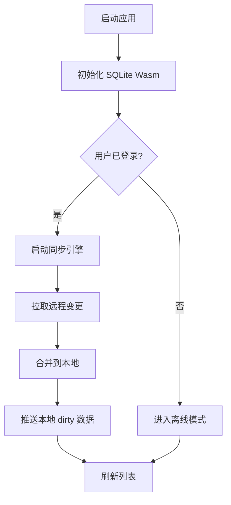

# Offline-First Markdown 笔记应用 PRD

## 1. 产品概述

一款基于 **SQLite Wasm** 的本地优先（Local-First）Markdown 笔记应用，支持离线编辑、自动云同步与全文搜索。
- 解决传统笔记应用"网络不稳时无法编辑"、"数据被锁定在单一平台"的问题。
- 目标用户：开发者、知识工作者、极客用户，重视数据自主权与离线可用性。
- 核心价值：数据归属本地、支持实时全文搜索、在线/离线无缝切换、跨端数据一致。

## 2. 核心功能

### 2.1 用户角色

| 角色 | 注册方式 | 核心权限 |
|------|----------|----------|
| 普通用户 | 邮箱 + 密码 | 创建/编辑/删除笔记、全文搜索、登录后启用云同步 |

### 2.2 功能模块
1. **登录页**：邮箱登录/注册，登录后绑定同步账户。
2. **笔记列表页**：侧边栏列出所有笔记、搜索框、新建笔记、同步状态指示。
3. **笔记编辑页**：Markdown 编辑器 + 实时预览、自动保存、删除操作。
4. **设置页**：导出/导入本地数据库、同步状态、手动触发同步。

### 2.3 页面详情

| 页面名称 | 模块名称 | 功能描述 |
|----------|----------|----------|
| 登录页 | 登录表单 | 邮箱/密码输入、登录/注册切换、未登录可进入离线模式 |
| 笔记列表页 | 侧边栏 | 列出笔记标题与更新时间、点击进入编辑 |
| 笔记列表页 | 全文搜索框 | 输入关键字，通过 SQLite FTS5 返回结果并高亮 |
| 笔记列表页 | 新建笔记按钮 | 创建新笔记并跳转到编辑页 |
| 笔记列表页 | 同步状态指示器 | 显示离线/在线/同步中/已同步状态 |
| 笔记编辑页 | Markdown 编辑器 | 左编辑右预览，支持语法高亮 |
| 笔记编辑页 | 自动保存 | 输入后防抖 500ms 写入本地 SQLite |
| 笔记编辑页 | 删除按钮 | 确认后软删除（sync 时同步为已删除） |
| 设置页 | 数据库管理 | 导出/导入 `.db` 文件，清空数据 |
| 设置页 | 同步管理 | 手动触发同步、查看最后同步时间 |

## 3. 核心流程

### 3.1 笔记编辑流程
1. 用户打开应用 → 初始化 SQLite Wasm 数据库（从 IndexedDB 加载或首次创建）。
2. 用户在列表页点击笔记 → 加载笔记数据至编辑器。
3. 用户编辑内容 → 防抖触发保存 → 写入本地 SQLite。
4. 如果已登录且在线 → 标记为 dirty，变更进入同步队列。

### 3.2 同步流程
1. 前端维护每张笔记的 `updated_at`（本地时间戳）与 `server_updated_at`。
2. 本地变更 → `dirty = true`，入队。
3. 检测到网络 + 登录 → 向后端 `POST /sync` 上传所有 dirty 记录。
4. 后端以 `server_timestamp` 为准合并（Last-Write-Wins），返回最新版本。
5. 前端写回本地并清除 dirty 标记。

## 4. 用户界面设计

### 4.1 设计风格
- 主色：深墨绿 `#1F7A5A`，辅助色：暖琥珀 `#D97706`，背景：米白 `#F7F3EC`。
- 按钮：圆润胶囊形，主按钮使用主色填充；次要按钮线框风格。
- 字体：标题使用 **Fraunces**（现代衬线），正文 **JetBrains Mono** 混排以提升 Markdown 观感。
- 布局：三栏式（导航 / 笔记列表 / 编辑预览），卡片化。
- 图标：Lucide 线性图标。

### 4.2 页面设计概览

| 页面名称 | 模块名称 | UI 要素 |
|----------|----------|---------|
| 登录页 | 登录卡片 | 居中玻璃拟态卡片，琥珀色主按钮，淡色背景 |
| 笔记列表页 | 三栏布局 | 左侧导航 + 笔记列表 + 编辑区，悬浮同步状态 |
| 笔记编辑页 | 编辑器 | 左侧行号编辑器、右侧渲染预览、顶部工具条 |
| 设置页 | 设置面板 | 分组卡片、数据管理按钮、同步状态时间线 |

### 4.3 响应式
- 桌面优先，宽度 < 768px 时自动切换为单栏：列表覆盖式抽屉，编辑区全屏。
- 触摸设备支持手势滑动切换列表与编辑区。
