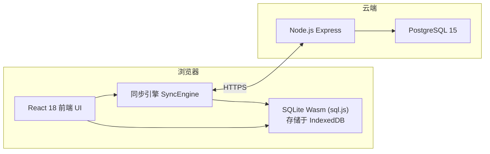
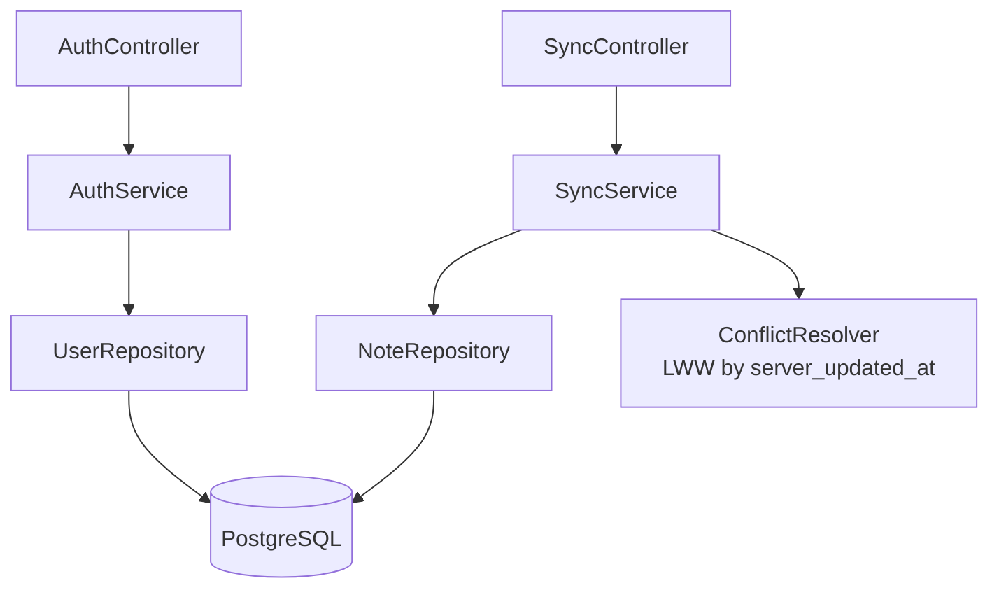
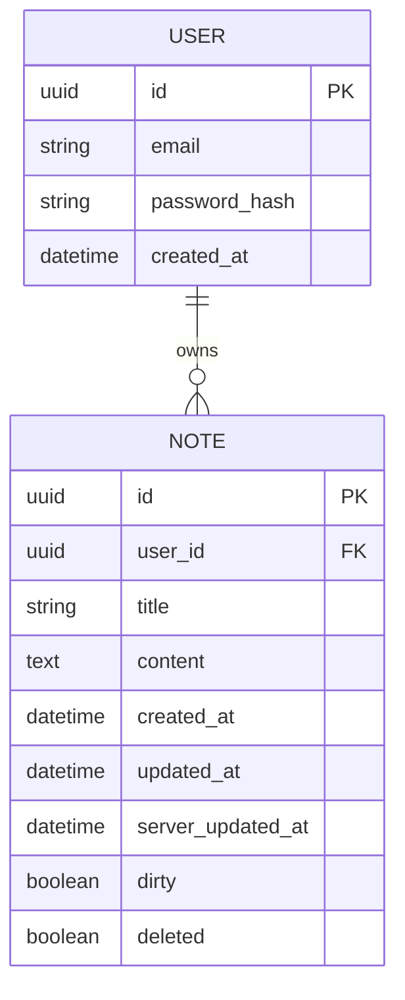

# Offline-First Markdown 笔记应用 技术架构

## 1. 架构设计



## 2. 技术说明
- **前端**：React 18 + Vite 5 + TypeScript + TailwindCSS 3 + Zustand（状态管理）。
- **本地数据库**：[`sql.js`](https://github.com/sql-js/sql.js)（SQLite Wasm 移植），数据库文件持久化到 IndexedDB（`localforage`）。
- **Markdown 编辑器**：`@uiw/react-md-editor`（或 CodeMirror6 + 自定义预览）。
- **全文搜索**：SQLite FTS5 虚拟表。
- **后端**：Node.js 20 + Express 4 + TypeScript。
- **云端数据库**：PostgreSQL 15（或 SQLite 作为 fallback 开发模式）。
- **认证**：JWT（access + refresh）。
- **网络感知**：`navigator.onLine` + `online/offline` 事件。

## 3. 路由定义

| 路由 | 用途 |
|------|------|
| `/login` | 登录 / 注册 |
| `/` | 笔记列表 + 编辑主界面 |
| `/note/:id` | 指定笔记编辑 |
| `/settings` | 设置页（数据库管理 / 同步） |

后端 API：

| Method | Path | 用途 |
|--------|------|------|
| POST | `/api/auth/register` | 注册 |
| POST | `/api/auth/login` | 登录 |
| GET  | `/api/notes` | 拉取所有笔记元信息 |
| POST | `/api/sync` | 推送本地变更 + 拉取远程（双向同步） |
| POST | `/api/notes` | 单条创建（调试用） |
| PATCH | `/api/notes/:id` | 单条更新 |
| DELETE | `/api/notes/:id` | 单条删除 |

## 4. API 定义

```ts
interface Note {
  id: string;                 // UUID
  title: string;
  content: string;            // Markdown
  created_at: string;         // ISO
  updated_at: string;         // 客户端时间戳
  server_updated_at?: string; // 服务器时间戳
  dirty: boolean;             // 是否需要同步
  deleted: boolean;           // 软删除
  user_id: string;
}

// 同步请求
interface SyncRequest {
  last_sync_at: string | null;
  changes: Note[];            // 仅 dirty 或 deleted
}

// 同步响应
interface SyncResponse {
  server_time: string;
  remote_changes: Note[];     // 服务器上比 last_sync_at 更新的记录
  accepted_ids: string[];     // 已合并的本地 ID
  conflicts: Array<{ id: string; server_version: Note }>; // LWW 已处理，可选返回
}
```

## 5. 服务端架构图



## 6. 数据模型

### 6.1 数据模型定义



### 6.2 DDL

```sql
-- PostgreSQL
CREATE TABLE users (
  id UUID PRIMARY KEY DEFAULT gen_random_uuid(),
  email TEXT UNIQUE NOT NULL,
  password_hash TEXT NOT NULL,
  created_at TIMESTAMPTZ NOT NULL DEFAULT now()
);

CREATE TABLE notes (
  id UUID PRIMARY KEY,
  user_id UUID NOT NULL REFERENCES users(id) ON DELETE CASCADE,
  title TEXT NOT NULL DEFAULT '',
  content TEXT NOT NULL DEFAULT '',
  created_at TIMESTAMPTZ NOT NULL,
  updated_at TIMESTAMPTZ NOT NULL,
  server_updated_at TIMESTAMPTZ NOT NULL DEFAULT now(),
  deleted BOOLEAN NOT NULL DEFAULT FALSE
);
CREATE INDEX idx_notes_user_updated ON notes(user_id, server_updated_at);

-- 前端 SQLite（sql.js）
CREATE TABLE notes (
  id TEXT PRIMARY KEY,
  title TEXT NOT NULL DEFAULT '',
  content TEXT NOT NULL DEFAULT '',
  created_at TEXT NOT NULL,
  updated_at TEXT NOT NULL,
  server_updated_at TEXT,
  dirty INTEGER NOT NULL DEFAULT 1,
  deleted INTEGER NOT NULL DEFAULT 0,
  user_id TEXT
);

-- FTS5 全文搜索虚拟表
CREATE VIRTUAL TABLE notes_fts USING fts5(
  title, content,
  content='notes', content_rowid='rowid'
);

-- 触发器保持 FTS 同步
CREATE TRIGGER notes_ai AFTER INSERT ON notes BEGIN
  INSERT INTO notes_fts(rowid, title, content) VALUES (new.rowid, new.title, new.content);
END;
CREATE TRIGGER notes_ad AFTER DELETE ON notes BEGIN
  INSERT INTO notes_fts(notes_fts, rowid, title, content) VALUES ('delete', old.rowid, old.title, old.content);
END;
CREATE TRIGGER notes_au AFTER UPDATE ON notes BEGIN
  INSERT INTO notes_fts(notes_fts, rowid, title, content) VALUES ('delete', old.rowid, old.title, old.content);
  INSERT INTO notes_fts(rowid, title, content) VALUES (new.rowid, new.title, new.content);
END;
```

## 7. 项目结构

```
f99/
├─ server/                 # Node.js 后端
│  ├─ src/
│  │  ├─ controllers/
│  │  ├─ services/
│  │  ├─ repositories/
│  │  ├─ db.ts
│  │  └─ index.ts
│  ├─ package.json
│  └─ tsconfig.json
├─ web/                    # React 前端
│  ├─ src/
│  │  ├─ components/
│  │  ├─ pages/
│  │  ├─ db/               # SQLite Wasm 封装 + FTS
│  │  ├─ sync/             # SyncEngine
│  │  ├─ store/            # Zustand
│  │  └─ main.tsx
│  ├─ package.json
│  └─ vite.config.ts
└─ README.md
```
